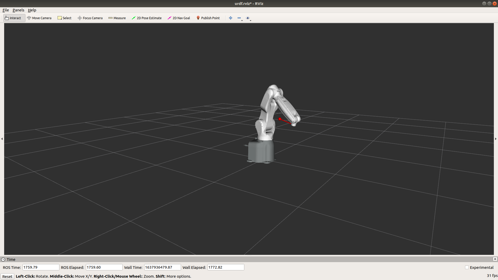
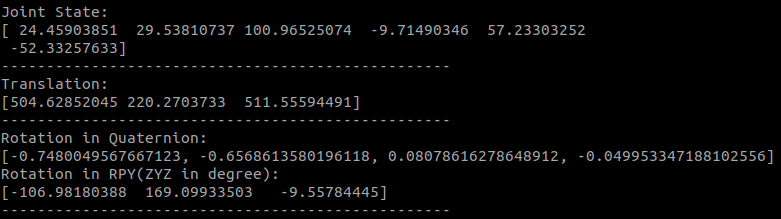

# HLRobot_gazebo
A simulation for QKM HL6-0900 6DOF robot based on gazebo


## Install
```bash
sudo apt-get install ros-melodic-ros-control ros-melodic-ros-controllers ros-melodic-gazebo-ros ros-melodic-gazebo-ros-control ros-melodic-hector-gazebo-plugins 
sudo apt-get install ros-melodic-sound-play 
pip install scipy
cd catkin_ws/src
git clone https://github.com/liuxiao916/HLRobot_gazebo.git
cd catkin_ws/
catkin_make
```


## Launch
```bash
roslaunch hlrobot_gazebo gazebo.launch
```

## File Structure
| File                    | Instruction                                                                                                                                                                                                           |
| ----------------------- | --------------------------------------------------------------------------------------------------------------------------------------------------------------------------------------------------------------------- |
| config                  | config file of controller in Gazebo                                                                                                                                                                                   |
| cubicTrajectoryPlanning | Include Forward and Inverse kinematics source file and motion planning source file to generate the music book. The music book (note and PPB) and the location of the insturment in Joint space (q_down) is also in it |
| data                    | The sound file of roll call and the picture for readme                                                                                                                                                                |
| launch                  | Launch file for simulation                                                                                                                                                                                            |
| meshes                  | The models for robot manipulators                                                                                                                                                                                     |
| rviz                    | The config file of rviz                                                                                                                                                                                               |
| scripts                 | Ros Python files                                                                                                                                                                                                      |
| udrf                    | The description file of the robot manipulators                                                                                                                                                                        |


## Control
In order to verify the forward and inverse kinematics, I use `position_controllers/JointGroupPositionController` for controller and `PositionJointInterface` for each joint. It means for every transmission the input is position and output is also position.

You can simply use this command to specify the angle (radian) of every joint.
```bash
rostopic pub /HL_controller/command std_msgs/Float64MultiArray "layout:
  dim:
  - label: ''
    size: 0
    stride: 0
  data_offset: 0
data: [0.426645, 0.515256, 1.761281, -0.169471, 0.998398, 5.370273]" 
```
## Frame
Frame `base_foorprint` and `tool_frame` are used to calibrate the world frame.(To get the world frame in lab) If you want to know the coordination in world frame, you can check the transform between them.
```bash
rosrun tf tf_echo base_footprint tool_frame
```
OR
```bash
rosrun hlrobot_gazebo show_tf.py
```
### Compare the frame in simulation and reality



## Load music book and play music
**Edit the path of music book(PPB files) in `scripts/publisher.py `**  
Music book is in `cubicTrajectoryPlanning/data/PPB`  
**Edit the path of the `cubicTrajectoryPlanning/data/q_down.txt` in `scripts/player.py`** 


```bash
rosrun sound_play soundplay_node.py
rosrun hlrobot_gazebo play.py
rosrun hlrobot_gazebo publisher.py 
```

OR
```bash
roslaunch hlrobot_gazebo gazebo.launch
roslaunch hlrobot_gazebo play_music.launch
```

## Todo
- [x] load angle of joints from txt file to control the robot
- [x] Try to play music in gazebo
- [x] Show world coordination 
- [ ] Implement the forward and inverse kinematics in this simulation
- [ ] Implement Motion Planning (Linear Function with Parabolic Blends) 
- [ ] Simply control the robot by giving Cartesian coordinate
- [ ] Anything useful 


